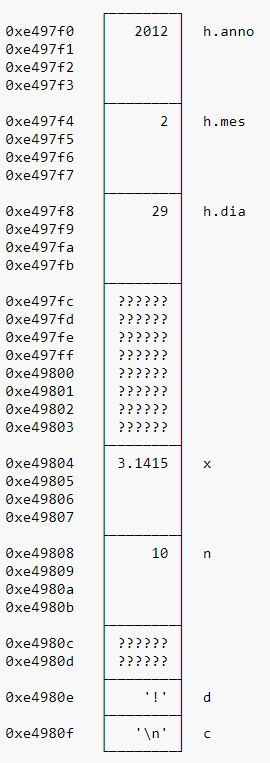

# Almacenamiento en memoria 

Todas las variables de un programa en C tienen un espacio en la memoria de la computadora.<br>
Estas tienen un tamaño en bits, y un bit es la unidad de almacenamiento más pequeña, puede contener 0 o 1.
<br> <br>
Podemos imaginar a la memoria como un arreglo de bits.<br>

<br>
Los bits estan agrupados en bytes. Un byte esta formado por 8 bits.
<br>

<br>
Todas las variadas declaradas en nuestro programa tienen una ubicación, y en esta dirección se almacena su información.

<br>

## Direcciones de Memoria 

Todos los bytes en la memoria tienen una dirección, que no es más que un índice correlativo, esto quiere decir que se almacenan uno detrás de otro. <br>
Las direcciones de memoria suelen escribirse en notación hexadecimal.<br>

<br>
En C, el operador ‘&’ nos permite obtener la dirección de la memoria en que está almacenada una variable, o más precisamente, la dirección de su primer byte.<br>

```
    printf("La dirección de la variable es: %p", &variable);
```

<br>

<br><br>
Suponiendo que declaramos diferentes variables de diferentes tipos, se encuentran ubicados en  la memoria de una forma similar a la siguiente:
<br>

<br>

<br>
En este caso, la variable "h" respresenta una estructura que contiene 3 variables de tipo "int".
