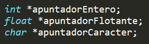
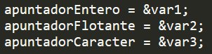
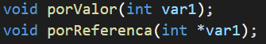

# Apuntadores 

### ¿Qué son?

Un apuntador es una variable que almacena la dirección de memoria de otra variable. Se dice que “apunta” a la variable cuyo valor se almacena a partir de la dirección de memoria que contiene el apuntador. 

### ¿Cómo se declaran?

Los apuntadores se declaran como cualquier otra variable, lo único que los diferencia es un “\*” que se coloca antes del nombre. 

### ¿Cómo utilizarlos?

Para utilizar los apuntadores les tenemos que asignar la dirección de memoria de otra variable. 

A partir de esto, se puede modificar directamente el valor de la variable inicial sin tener que utilizarla. 

## Paso por Valor y Paso por Referencia

Esto hace referencia a las variables que se pasan como parámetros en una función.

### Paso por valor

Se pasa una “copia” de la variable, y cualquier modificación que se haga en esta, no afecta a la original.

### Paso por Referencia

En paso por referencia se pasa la variable original, por esto cualquier modificación se verá reflejada fuera de la función.
En este caso en particular, al momento de definir la función, los parámetros que recibe llevaran un ‘\*’ antes del nombre de estos.

